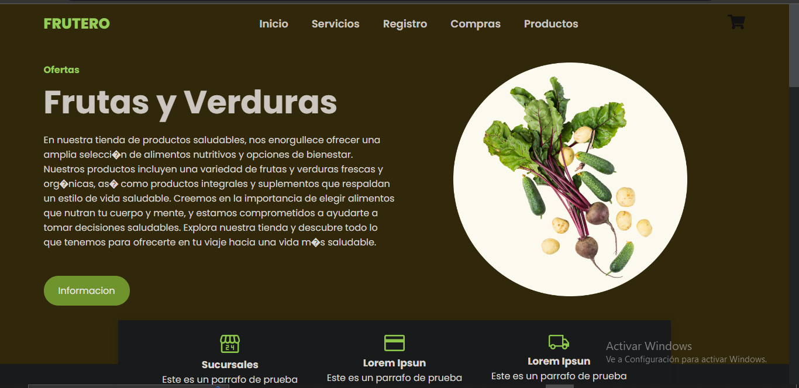
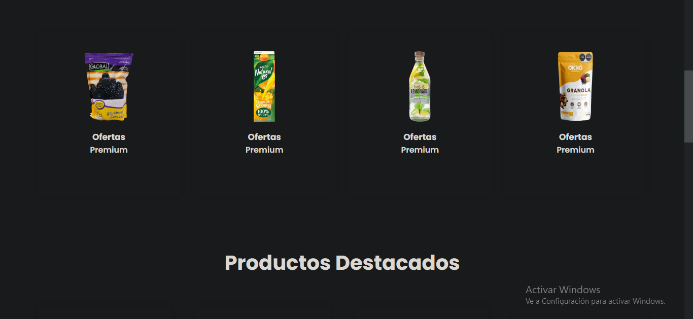
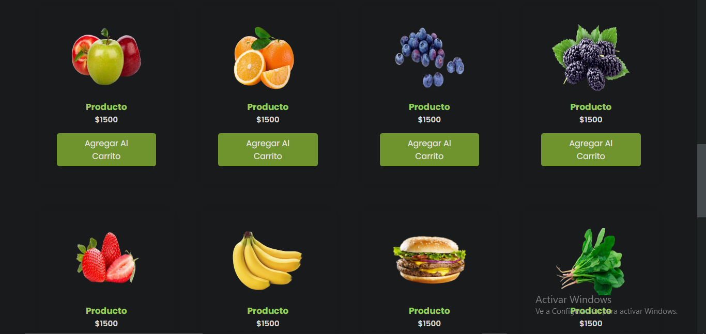

# Tienda Virtual de Productos Saludables

Bienvenido a la Tienda Virtual de Productos Saludables. Este proyecto tiene como objetivo facilitar la compra de una amplia variedad de productos saludables, incluyendo frutas y verduras frescas.


## Integrantes

Este proyecto está siendo desarrollado por un equipo comprometido con la promoción de un estilo de vida saludable y accesible para todos. A continuación, te presentamos a los miembros del equipo:

1. **VICTOR MANUEL CRUZ JOANIQUINA**
2. **CONRADO GROVER VELIZ VASQUEZ**
3. **JUAN DAVID CONDORI CARI**
   
   ## Informe

 ### Requerimientos Funcionales

El sistema cuenta con los siguientes requerimientos funcionales:

1. **Registrar Productos** 

   - **Descripción:** Permite a los administradores del sistema registrar nuevos productos saludables en la tienda virtual.

2. **Registrar Ventas** 

   - **Descripción:** Permite a los usuarios realizar compras de productos saludables y registrar estas ventas en el sistema.
   - 
3. **Registrar Clientes** 

   - **Descripción:** Permite registrar usuarios para luego añadirlos a la base de datos.

## Capturas del sistema




## Cómo Contribuir

Si deseas contribuir a este proyecto, sigue estos pasos:

1. Haz un "Fork" del repositorio en GitHub.

2. Clona el repositorio en tu máquina local:

   ```bash
   git clone https://github.com/JUAND4V1D/Tienda-Virtual-Productos-Saludables.git
